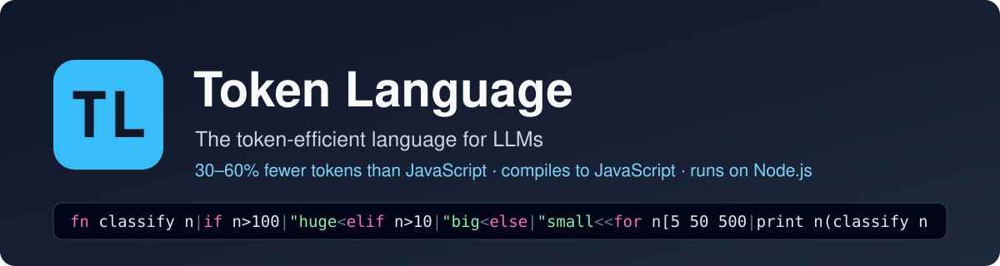

<p align="center">
  
</p>

# TL — Token Language: code written for models, shown readable to people

<p align="center">
  
  
  
  
  
</p>

TL is a programming language designed to be written and read by language models with as few tokens as possible.
It compiles to JavaScript and runs on Node.js, the way TypeScript does. **TL saves roughly
<ins>30–60% of the tokens</ins>** of the same program written in JavaScript.

**Tokens.** A model does not read characters, it reads tokens (word pieces), and cost, speed and how much code fits
in its context all depend on the token count. TL removes the tokens a model does not need: indentation, brackets,
call punctuation, repeated long names. → [How the language saves tokens](#how-the-language-saves-tokens)

**VS Code.** TL source is one dense line, so people do not read it directly. The VS Code extension shows every
`.tl` file as ordinary indented code with full names, read-only. → [VS Code extension](#vs-code-extension)

**Learning library for models.** A model learns to write TL from a small library of instruction files in this
repository: one page of core rules plus 21 topic files it opens on demand. → [Teach a model to write TL](#teach-a-model-to-write-tl)

[Benchmarks](#benchmarks) · [Key capabilities](#key-capabilities) · [Quick start](#quick-start) · [Install](#install) · [Using TL](#using-tl) · [The dictionary](#the-dictionary-tldef) · [VS Code extension](#vs-code-extension) · [Teach a model](#teach-a-model-to-write-tl) · [Roadmap](lib/ROADMAP.md)

**What the model writes** (one line, 39 tokens):

```
+semver.Sem|fn parse version options=none the=false|if version is Sem|^version<try|Sem version options<catch e|if not the|^null<!e
```

**What a person sees** in VS Code or with `tl view`:

```
import semver.SemVer

fn parse version options=none throwErrors=false
    if version is SemVer
        return version
    try
        SemVer version options
    catch e
        if not throwErrors
            return null
        raise e
```

## Benchmarks

Seven open-source projects were converted from their original JavaScript to TL: five applications and two
libraries, 276,117 tokens of JavaScript in total. The TL versions need 169,933 tokens, <ins>**38% fewer**</ins>,
and <ins>**28% fewer**</ins> than the same JavaScript with its comments removed. Every TL version passes the
project's own test suite, unchanged.

Tokens are counted with the `o200k` tokenizer (GPT-4o / GPT-5 family). A version only counts if it passes the
same tests as the original. TL counts include `tl.def`, the project's dictionary of long names
([explained below](#the-dictionary-tldef)).

### Five real applications

| | Original JS | JS without comments | TL (source + `tl.def`) | TL vs JS | TL vs JS without comments | The project's own tests (both versions) |
|---|---|---|---|---|---|---|
| **Hubot** — chat bot, 18 modules | 29,411 | 22,838 | 16,964 (15,652 + 1,312) | <ins>**−42%**</ins> | <ins>**−26%**</ins> | 286 pass |
| **Raneto** 0.18.1 — knowledge-base web app, 34 modules | 14,920 | 13,126 | 9,182 (7,828 + 1,354) | <ins>**−38%**</ins> | <ins>**−30%**</ins> | 221 pass |
| **Ungit** 1.5.30 — git web UI (server), 12 modules | 27,773 | 25,051 | 17,421 (15,729 + 1,692) | <ins>**−37%**</ins> | <ins>**−30%**</ins> | 230 pass |
| **expressCart** 1.1.19 — online shop, 34 modules | 55,690 | 50,143 | 36,265 (33,698 + 2,567) | <ins>**−35%**</ins> | <ins>**−28%**</ins> | 86 pass |
| **hackathon-starter** 10.0.0 — web app with accounts and OAuth, 16 modules | 57,691 | 49,310 | 38,571 (34,432 + 4,139) | <ins>**−33%**</ins> | <ins>**−22%**</ins> | 327 pass |
| **All five** | 185,485 | 160,468 | 118,403 | <ins>**−36%**</ins> | <ins>**−26%**</ins> | |

### Two real libraries

| | Original JS | JS without comments | TL (source + `tl.def`) | TL vs JS | TL vs JS without comments | The project's own tests (both versions) |
|---|---|---|---|---|---|---|
| **node-semver** 7.8.5, 47 modules | 19,189 | 15,044 | 9,715 (9,246 + 469) | <ins>**−49%**</ins> | <ins>**−35%**</ins> | 9,074 assertions pass |
| **validator.js** 13.15, 103 modules | 71,443 | 61,301 | 41,815 (39,887 + 1,928) | <ins>**−41%**</ins> | <ins>**−32%**</ins> | 13,289 cases pass |

The fair comparison is the one against JavaScript without comments, because TL files carry none.

How to read these numbers:

- **Applications gain less than libraries.** Application code is mostly calls into other people's APIs (Express,
  MongoDB, Passport, payment gateways): their names and string literals cost the same in any language. Calling
  JavaScript libraries from TL also has a cost today, for example a plain JavaScript object needs a helper call.
  hackathon-starter is the lowest for this reason.
- **The tests are the projects' own**, run unchanged against the compiled TL in place of the original modules.
  They do not reach every line of an application, so each application was also run side by side with the
  original on code its suite misses; `Projects/README.md` lists what was compared and the known differences.
- About 42% of the TL version of validator is regular-expression text (phone numbers, postal codes, IBANs), which
  is the same in any language; that is why it gains less than semver, which is mostly logic.

### Five small programs, written from one specification in each language

| Program | JS | TS | TL | TL vs JS | TL vs TS |
|---|---|---|---|---|---|
| Todo REST API | 774 | 870 | 295 | <ins>−62%</ins> | <ins>−66%</ins> |
| Log analyzer CLI | 704 | 732 | 495 | <ins>−30%</ins> | <ins>−32%</ins> |
| Inventory manager | 747 | 842 | 552 | <ins>−26%</ins> | <ins>−34%</ins> |
| Markdown to HTML | 699 | 728 | 584 | <ins>−16%</ins> | <ins>−20%</ins> |
| Concurrent bank ledger | 395 | 471 | 263 | <ins>−33%</ins> | <ins>−44%</ins> |

The Todo API result comes mostly from TL's built-in HTTP and storage helpers; against JavaScript written with
Express it is −49%. The other four show what the syntax alone gives: 16–33%.

### Reproducing

```sh
cd Projects && npm install
node bench.js              # every project: token counts and tests; writes results/
node bench.js semver       # one project
```

The application projects have their own dependencies (`npm install` inside the project folder), and expressCart's
tests need a MongoDB server; `Projects/README.md` has the commands.

Per-project tables are in `Projects/results/`. How each project is tested is described in `Projects/README.md`.

## Key capabilities

- **Token-minimal syntax**: one line per file, no call parentheses or commas, closers only when something follows,
  one-character statement forms (`^` return, `!` raise, `?` propagate, `+` import), pipelines with `>>`.
- **Runs like TypeScript**: `tlc` compiles a project to plain ES modules, `tl run` executes a file, and a Node loader
  runs `.tl` directly. The output uses the long, readable names and is importable from JavaScript.
- **A mandatory dictionary**: compound names live once in `tl.def`; the source writes a one-token symbol.
  `tl def` creates and maintains it.
- **Readable for people**: the VS Code extension and `tl view` render the same file as indented code with full
  names. The rendering is read-only and is checked to keep the source's tokens.
- **Built for models**: a short rule file plus 21 topic files a model opens on demand; diagnostics give an error
  code, the column and a named fix.
- **Measured, not claimed**: every benchmark version must pass the same tests; for the seven open-source projects
  these are the projects' own test suites.

## Quick start

```sh
git clone https://github.com/krdanny/tl-lang.git && cd tl-lang/lib
npm install && npm install -g .          # the `tl` and `tlc` commands

tl run examples/loops.tl                 # run a TL file
tl view ../Projects/semver/tl/range.tl   # read a TL file
```

Full steps, including the VS Code extension, are under [Install](#install); a first project is walked through in
[Using TL](#using-tl).

## Install

**Requirements:** Node.js 20.6 or newer, and git. VS Code is only needed for the readable view.

### 1. Get the code

```sh
git clone https://github.com/krdanny/tl-lang.git
cd tl-lang
```

### 2. Install the compiler

```sh
cd lib
npm install          # one dependency: the tokenizer `tl def` uses to pick symbols
npm test             # optional: 40 checks + 189 documentation examples
npm install -g .     # puts the `tl` and `tlc` commands on your PATH
tl --version         # tl 0.1.0
```

If you prefer not to install globally, either call the compiler by path (`node /path/to/tl-lang/lib/bin/tl.js …`)
or add it to one project with `npm install /path/to/tl-lang/lib` and use `npx tl …`.

### 3. Install the VS Code extension (optional, for reading TL)

```sh
cd ../vscode
npm install
npm run package                                   # builds tl-readable-0.2.1.vsix
code --install-extension tl-readable-0.2.1.vsix
```

Then reload VS Code (Ctrl+Shift+P → "Developer: Reload Window"). See [VS Code extension](#vs-code-extension).

## Using TL

### Create a project

```sh
mkdir my-app && cd my-app
tl init
```

This creates `tlconfig.json`, `package.json`, `src/main.tl` (a hello-world) and `src/tl.def` (the dictionary,
empty for now).

```sh
tl run src/main.tl        # Hello from TL
```

### Write a program

A `.tl` file is one line. Put this in `src/main.tl`:

```
fn isAdult age|age>=18<for p[["Ann" 31] ["Bo" 12]|print p[0](isAdult p[1])
```

`isAdult` is a compound name, so the compiler asks for a dictionary entry:

```sh
tl check src/main.tl
# E261 'isAdult' is a compound name: give it a short symbol in tl.def … ('tl def' does both)
```

Let the tool do it:

```sh
tl def src
#   ib    isAdult  (2x)
# src/tl.def: added 1 name(s); 1 of 1 .tl file(s) rewritten
```

`src/tl.def` now contains `ib isAdult`, and the source reads `fn ib age|age>=18<…`. When you (or a model) write new
code, add the line to `tl.def` yourself and use the symbol directly.

### Run, read, build

```sh
tl run src/main.tl          # run it:            Ann true / Bo false
tl view src/main.tl         # read it:           indented, with the long names
tl compile src/main.tl      # see the JavaScript it becomes
tl fmt src/main.tl          # canonical form (minimal spaces and closers)
tl test src                 # run test"…" blocks in *.tl files

tlc                         # compile src/ to dist/ (settings in tlconfig.json), like tsc
node dist/main.js           # the output is plain JavaScript and needs nothing but Node
```

`tl view` shows what a person should read:

```
fn isAdult age
    age>=18

for p[["Ann" 31] ["Bo" 12]]
    print p[0] (isAdult p[1])
```

### Run TL files directly with Node

With `tl-lang` installed in the project (`npm install /path/to/tl-lang/lib`):

```sh
node --import tl-lang/register src/main.tl
```

### Use a TL module from JavaScript

The compiled output is an ES module with the long names, so JavaScript imports it like any other file:

```js
import { isAdult } from './dist/main.js';
```

### Tests

A test is a `test"name"|…` block; `assert` checks a condition:

```
fn add a b|a+b<test"adds"|assert(add 2 3)==5
```

```sh
tl test src                 #   ok   adds     1 passed, 0 failed
```

### Let a model write the code

Give the model [`lib/TL_INSTRUCTIONS.md`](lib/TL_INSTRUCTIONS.md) (and access to `lib/tl-dictionary/` for the topic
files it points to), plus the project's `tl.def`. Ask it to keep `tl.def` up to date and to run `tl check` on what it
writes; the diagnostics name the column and the fix. See
[Teach a model to write TL](#teach-a-model-to-write-tl).

### Try the examples and benchmarks in this repository

```sh
tl run lib/examples/loops.tl
tl view Projects/semver/tl/range.tl
cd Projects && npm install && node bench.js      # token counts and tests for the small programs and libraries
```

## How the language saves tokens

- **One line per file.** `|` ends a statement and enters a body, `<` leaves a body. No indentation, no braces, no
  newlines.
- **No call punctuation.** `add 2 3` instead of `add(2, 3)`. Tightly written operators bind first, so `f a+1`
  is `f(a+1)`.
- **Closers only when something follows.** `print"hi` and `xs[1 2 3` are complete at the end of a statement.
- **Bindings without a sign.** `x 5` declares, `x=6` assigns.
- **Short statement forms.** `^x` returns, `!Err` raises, `call?` propagates an error, `+mod.name` imports.
- **Pipelines.** `xs>>filter f>>map g>>list`.
- **A standard library that removes boilerplate.** For example an HTTP server with JSON persistence and route
  patterns; this is where the largest saving comes from (62% on the Todo API below).
- **A dictionary for long names** — next section.

The generated JavaScript is plain ES modules and uses the long, readable names, so a TL module can be imported
from JavaScript like any other module.

## The dictionary: `tl.def`

Every TL project has a `tl.def` file; the compiler refuses to compile without one. Compound names — camelCase,
multi-word PascalCase, snake_case — are not allowed in `.tl` files. Each gets one line in `tl.def` and the source
writes only the short symbol:

```
ip includePrerelease
cid compareIdentifiers
Sem SemVer
```

The reason is how tokenizers work: `options` is one token, but `isPrereleaseIdentifier` is four, every time it is
written. With the dictionary a long name is paid for once. The generated JavaScript, error messages and the
readable view all show the long names.

`tl def` writes the file for an existing project: it finds every compound name, picks a symbol that is a single
token, rewrites the sources and adds the lines.

What it is worth, measured: source files shrink 7% (semver) and 4% (validator). Counting the dictionary itself,
semver is 2.6% smaller and validator 0.2% larger, because most of validator's 401 compound names are used only once
or twice. The rule is unconditional anyway: a model writing code cannot know in advance how often a name will be
used. Details in `lib/tl-dictionary/tl-def.md`.

## Toolchain

All commands are `node lib/bin/tl.js <command>` (or `tl <command>` once the package is linked).

| Command | What it does |
|---|---|
| `tl run file.tl` | compile in memory and run |
| `tl check file.tl` | diagnostics only, in a compact form with a column and suggested fixes |
| `tl compile file.tl` | print the generated JavaScript |
| `tl fmt file.tl` | rewrite in canonical form (minimal spaces and closers) |
| `tl def [dir]` | create or update `tl.def` and replace compound names by symbols |
| `tl view file.tl` | readable rendering: indented, closers restored, long names |
| `tl test` | run `test"…"` blocks |
| `tlc` | compile a project described by `tlconfig.json`, like `tsc` |

## VS Code extension

`vscode/` contains **TL Readable View**. TL source is a single dense line, so the extension shows people a
rendering instead, and that rendering is read-only.

What it does when a `.tl` file is opened:

- Shows one statement per line with indentation, in place of the one-line source.
- Shows the long names from `tl.def` instead of the symbols.
- Restores closing quotes and brackets, and spaces between operands.
- Spells out the statement sigils: `^` as `return`, `+` as `import`, `!` as `raise`, a binding `x 5` as `x = 5`.
- Wraps long lists and maps, so large tables show one entry per row.
- Provides syntax highlighting, outline, folding, hover help for TL words and sigils, and compile errors in the
  Problems panel.
- Re-renders when the file changes.

The rendering never reorders or rewrites expressions; it prints the source's own tokens. This is checked: for
every `.tl` file in the repository the rendering lexes back to the identical token stream.

Read-only by design: the view is a virtual document, and the raw one-line source also opens locked. The commands
**TL: Open Raw Source** and **TL: Unlock Raw Source for Editing** are there for the cases where a hand edit is
wanted. Toolbar buttons switch between long names and symbols, and between words and sigils.

How to use it once installed (see [Install](#install), step 3):

1. Open any `.tl` file. It opens as `<name>.tl.view`, the readable rendering.
2. Use the Outline panel, folding and Ctrl+F as in any editor; hover a word or sigil for an explanation.
3. The toolbar at the top right of the editor switches long names ↔ symbols and words ↔ sigils, and opens the
   raw source. The same commands are in the command palette under "TL:".
4. Right-click a line → **Reveal This Line in Raw Source** to see the segment behind it.
5. To edit by hand: **TL: Open Raw Source**, then **TL: Unlock Raw Source for Editing**.

To work on the extension itself: `cd vscode && npm test` (builds, then 19 tests), or open the `vscode/` folder in
VS Code and press F5.

The extension works in Restricted Mode (untrusted folders): it only reads and renders files. Settings and the
full command list are in `vscode/README.md`. The same rendering is available in a terminal with `tl view`.

## Teach a model to write TL

TL is new, so no model knows it from training. Everything a model needs is in the learning library under `lib/`,
written for models rather than people: short rules, one example per rule, and the exact output of each example.
All examples are executed by the test suite, so the library cannot drift from the compiler.

| File | What it teaches | Size |
|---|---|---|
| [`lib/TL_INSTRUCTIONS.md`](lib/TL_INSTRUCTIONS.md) | The dictionary rule, the ten core rules, the workflow, and an index of the topic files. **Always give this one.** | ~1,700 tokens |
| [`lib/tl-dictionary/`](lib/tl-dictionary/) | 21 topic files, opened only when needed | ~750 tokens each, ~15,600 in total |

The topic files:

| Topic | File |
|---|---|
| Structure of a file, segments and bodies | `structure.md`, `spacing-and-closers.md` |
| Bindings, calls, operators | `bindings-and-calls.md`, `operators.md` |
| Numbers, strings, regex, interpolation | `literals-and-strings.md` |
| Conditions, loops, pattern matching | `conditionals.md`, `loops.md`, `match.md` |
| Functions, lambdas, pipelines | `functions-and-lambdas.md`, `pipelines-and-iterators.md` |
| Lists, maps, sets | `collections.md` |
| Types, methods, constructors, subclasses | `types-and-methods.md` |
| Errors and optionals | `errors-and-optionals.md` |
| Async and concurrency | `async.md` |
| Modules and JavaScript interop | `modules-and-interop.md` |
| The dictionary file | `tl-def.md` |
| Standard library, recipes, testing, tools | `stdlib.md`, `recipes.md`, `testing.md`, `tooling.md` |
| Common mistakes and current limits | `mistakes-and-limits.md` |

How to use it:

- **Chat or API:** put `TL_INSTRUCTIONS.md` in the system prompt, together with the project's `tl.def`. Add the
  topic files that fit the task (for a web server: `stdlib.md` and `async.md`), or all of them if context allows.
- **Coding agent with file access** (Claude Code, Cursor, …): point it at the files from your project instructions,
  for example in `CLAUDE.md`:

  ```
  This project is written in TL. Before writing TL, read lib/TL_INSTRUCTIONS.md and open the files it lists in
  lib/tl-dictionary/ for the topic at hand. Keep tl.def up to date. Run `tl check` on every file you change.
  ```

- **Let the compiler correct the model.** The workflow is `tl def` → `tl check` → `tl fmt` → `tl run`. Diagnostics are
  written for a model: an error code, the column, and a named fix, so one round of `tl check` usually repairs a slip.

## What is in this repository

| Folder | What it is |
|---|---|
| `lib/` | The compiler and tools (`tl-lang`): lexer, parser, JavaScript emitter, runtime, formatter, CLI (`tl`, `tlc`), Node loader, tests. Pure JavaScript, no build step. |
| `lib/TL_INSTRUCTIONS.md`, `lib/tl-dictionary/` | The language reference written for models: core rules in one file, 21 topic files to open on demand. Every example in them is run by the test suite. |
| `lib/TL_Language_Specification_v0.1.docx` | The original design specification. It predates several changes made during implementation; the instructions and dictionary above describe the language as it works today. |
| `Projects/` | Token benchmarks: five small programs written in JavaScript, TypeScript and TL; two open-source libraries (validator.js, node-semver) and five open-source applications (expressCart, hackathon-starter, Hubot, Ungit, Raneto) converted to TL. `bench.js` counts tokens and runs every version against the same tests. |
| `vscode/` | The VS Code extension that shows `.tl` files as readable, read-only code. |

## Resources

- 📘 [Core rules for models](lib/TL_INSTRUCTIONS.md) — the file to give an LLM
- 📚 [Topic dictionary](lib/tl-dictionary/) — 21 files: loops, errors, pipelines, types, interop, common mistakes, …
- 🗺️ [Roadmap](lib/ROADMAP.md) — next steps for JavaScript, and the plans for Python, C#, Rust and further hosts
- 🗂️ [The `tl.def` dictionary](lib/tl-dictionary/tl-def.md) — format, rules, error codes
- 📊 [Benchmark results](Projects/results/README.md) and [how they are produced](Projects/README.md)
- 🧩 [VS Code extension](vscode/README.md) — commands and settings
- 🛠️ [Compiler and CLI](lib/README.md)
- 📄 [Original design specification](lib/TL_Language_Specification_v0.1.docx) (predates several implementation changes)

## Status and limits

TL/JS 0.1 is a working compiler, not a finished language.

- Types are parsed and erased, except simple parameter annotations (`s:str`), which are checked at run time.
- No macros, effects or ownership; `thread` is an async task.
- Calling JavaScript libraries works but is not yet smooth: there is no plain-object literal, reading a
  function-valued property calls it (`req["app"]` reads it), and a TL panic (member of `none`, index out of range)
  is not caught by `catch`. `lib/tl-dictionary/mistakes-and-limits.md` lists these and the workarounds.
- A call to a function that can raise must be propagated with `?` or handled; used directly in a condition it
  is an always-true result object. This is the easiest mistake to make in TL today.
- The token figures are for the `o200k` tokenizer. Other tokenizers will give somewhat different numbers.
- JavaScript is the only host language today. `lib/ROADMAP.md` describes what is planned: Python, C# and Rust as
  further hosts, in both directions (TL to the host, and existing host code into TL).

## Third-party code

The benchmark projects include the sources and tests of the open-source projects they are measured against:
validator.js, expressCart, hackathon-starter, Hubot, Ungit and Raneto (all MIT) and node-semver (ISC). See
`THIRD_PARTY.md`.
